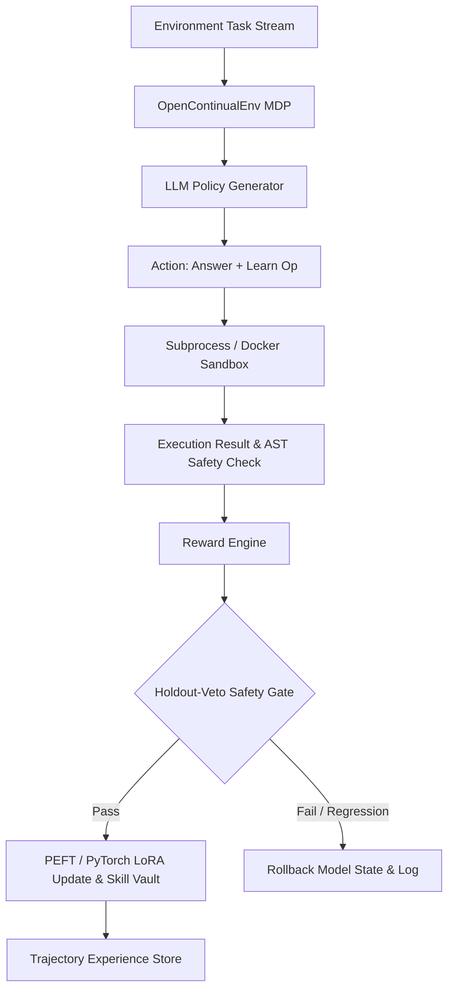

# Grounded Continual Learning (GCL) & OpenContinualEnv

**Status: Real Platform with Verified, Reproducible Continual Learning** — *Not a mock framework or production shell.*  
A single GPU (e.g., RTX 4060 Ti 16GB or Kaggle T4) runs the entire pipeline: real PyTorch/PEFT LoRA weight updates, execution-grounded rewards, safe-gated model promotion, and measurable catastrophic forgetting — with every claim verifiable from logged execution artifacts.

**New: Self-Certified Continual Learning (SCCL)** — the model certifies its *own* learning targets from the task specification alone (self-spec test bags → discriminative consensus → self-replay veto), so **no gold labels enter the learning loop or the safety gate**. Gold is used only for final evaluation and post-hoc telemetry. The gold-free guarantee is structural (API shape) and enforced by a 54-test proof suite including AST audits and adversarial poisoned-gold environments (`tests/test_sccl.py`).

**SCCL v2 — self-manufactured stability.** A fine-grained diagnosis of v1 showed its residual forgetting is almost entirely *unvisited-generalization* loss (trained tasks retained, same-family holdouts collapse; math entries never gate-checked). v2 adds three gold-free mechanisms (`configs/sccl_v2.json`): **certified rehearsal** (every update also trains on stride-sampled pairs from the self-certified vault), **neighborhood probes** (at certification the model manufactures a certified spec variant — paraphrase + bidirectional cross-validation for code, numeric variant + majority vote for math — stored as `kind="probe"`, never trained on, re-checked by RRV so the gate protects a generalization neighborhood), and **math-RRV** (the veto extended to math vault entries via canonical-form answer matching). Probe manufacture is a spec-only API (`MakeProbe(engine, verifier, spec, domain, CertResult)`) covered by the same AST/signature/poisoned-gold audits.

**SCCL v3 — neighborhood certification at admission.** The v2 rerun showed gate-side neighborhood checks achieve the lowest forgetting among gold-free rows but at a plasticity price: more vetoes, fewer accepted updates, lower accuracy. v3 moves the neighborhood check *upstream of the gradient*: `CheckNbhd(engine, verifier, spec, domain, CertResult)` manufactures a spec variant (paraphrase + fresh self-tests for code; numeric variant + majority vote for math) and requires the certified winner to pass it *before* the target may train. The decision policy is evidence-based and asymmetric: evidence that cannot be manufactured admits (open decision); manufactured evidence of fragility rejects (closed decision). `sccl_n` isolates the mechanism; `sccl_promote` keeps the probe-curriculum variant (probes that survive enough RRV checks graduate into certified rehearsal pairs). Ladder: `configs/sccl_v3.json`.

**Seeded protocol.** Pre-v3 runs were unseeded; the identical configuration scored ACC 0.637 and 0.744 in two runs (variance concentrates in arithmetic-holdout generalization while math acquisition is robust). Set `torch_seed` (>0) in the experiment config to seed torch/CUDA/numpy/Python RNG per learner, and use `python scripts/run_seeds.py --config <cfg> --seeds 42,43,44` for multi-seed ladders — the aggregator refuses to report mean±std unless all seeds walked the same clean stream.

---

## 🌟 Key Capabilities & System Architecture

OpenContinualEnv and Grounded Continual Learning (GCL) provide an open research substrate for lifelong adaptation of Code LLMs in deployed execution environments.



### Core Features

- **Gymnasium & HF OpenEnv Standard Interface (`open_continual_env.env.core_env.OpenContinualEnv`)**: Standardized `reset()` / `step()` lifelong MDP loop enabling seamless integration with RL frameworks.
- **Isolated Execution Sandbox (`PythonSandbox` & Docker)**: Real Python subprocess and Docker sandboxing with strict AST safety inspection, timeout limits, and error capturing.
- **Grounded Continual Learning Engine (`gcl.engine.TrainingEngine`)**: True PyTorch + PEFT Adam optimizer steps with EWC (Elastic Weight Consolidation), Replay Rehearsal, and AST-deduplicated Skill Vault (`gcl.vault`).
- **Self-Taught Rehearsal & VSR (`gcl.selftaught` & `gcl.probe_gen`)**: Verification, Self-Reflection, and Rehearsal search for backward transfer optimization.
- **Self-Certified Continual Learning (`gcl.selfcert`)**: Gold-free certification loop — self-spec test bags, discriminative filtering, consensus confidence (with unanimous-pool rule), and the Self-Replay Veto (RRV) safety gate that rolls back any update regressing previously certified skills against their own stored self-tests.
- **Holdout-Veto Model Promotion & Safety Gating (`gate_epsilon=0.05`)**: Evaluates candidate updates against a private holdout set before publication. Any regression triggers an immediate snapshot rollback. Under SCCL the holdout gate is replaced by RRV; the holdout becomes telemetry-only.
- **Anti-Contamination Canary Infrastructure (`gcl.curriculum.canary_report`)**: Deterministic task partitioning by ID and content fingerprinting for MBPP & HumanEval benchmark splits.
- **Contextual-Bandit Option-Policy Router (`open_continual_env.controller.learning_controller`)**: Cost-aware dynamic Mixture-of-Adapters (MoA) routing across specialized adapter heads.
- **Trajectory Experience Store (`open_continual_env.trajectory.store`)**: Comprehensive JSON/JSONL logging for offline RL, DPO fine-tuning, and trajectory auditing.
- **106 E2E Test Suite Across 4 Tiers**: Complete multi-tier test infrastructure (`tests/e2e/`) covering API contracts, edge cases, pairwise interactions, and multi-episode scenarios.
- **Cloud & Dashboard Deployment**: One-click Kaggle notebook generation (`build_notebook.py`), Hugging Face Space deployment scripts (`hf_space_upload/`), and interactive Streamlit visualization dashboard (`app.py`).

---

## 🔬 What This Is (and Is Not)

| Component | Toy / Naive Implementations | GCL & OpenContinualEnv |
|---|---|---|
| **LoRA Weight Updates** | Mutated temporary matrix or fake adapter shifts | Real `peft` + `torch` Adam optimizer steps; weight shift verified in log |
| **Continual Metrics (`BWT`, `FWT`)** | Fabricated `0.000` numbers | Measured from actual execution runs on MBPP/HumanEval |
| **Learning Controller** | Hardcoded keyword string matching | Contextual-bandit option-policy router (cost-aware, learning-rate-tunable) |
| **Safety & Anti-Regression** | Token penalty in reward function only | Holdout-veto rollback: snapshot → update → gate eval → keep/rollback |
| **Dataset Integrity** | Blind training on full benchmark | Deterministic content-hash canary split (`clean=True` anti-contamination) |
| **Testing Infrastructure** | Minimal unit tests | 106 E2E tests across 4 tiers + comprehensive unit test suite |
| **Reproducibility** | Hand-written metrics | Single-command execution regenerating `metrics.json` and `paper/results.tex` |

---

## ⚓ Trust Anchors (Verifiable Claims)

1. **Real Gradient & Weight Shift**: Verified training loss drop (e.g. `0.178 → 0.001` in smoke tests) and measurable max logit shift between base model and adapters.
2. **Strict Anti-Contamination**: MBPP and HumanEval datasets are split into non-overlapping `train` and `holdout` partitions by task ID and SHA-256 fingerprint. Runner raises if overlap occurs.
3. **Execution-Grounded Verification**: Every code action is executed inside an isolated sandbox. Code execution status, stdout/stderr, and test pass rates determine real rewards.
4. **Holdout-Veto Safety Gate**: Candidate adapter updates are evaluated against private holdout tasks. Updates degrading baseline accuracy by more than `gate_epsilon=0.05` are automatically rolled back.

---

## 📁 Repository Layout

```
open_continual_env/             OpenContinualEnv Core Package
├── env/                        Gymnasium & OpenEnv core environment, rewards & sandboxes
│   ├── core_env.py             Lifelong MDP interface (OpenContinualEnv)
│   ├── rewards.py              Multi-component reward engine (exec, AST, quality)
│   └── sandbox.py              Subprocess execution sandbox with AST checks
├── baselines/                  Continual learning baseline implementations
│   ├── memory_baseline.py      Experience replay buffer baseline
│   ├── lora_baseline.py        Online PEFT LoRA adapter baseline
│   ├── hybrid_baseline.py      Combined Replay + LoRA baseline
│   ├── jitrl_baseline.py       Just-In-Time Reinforcement Learning baseline
│   └── dynamic_moa.py          Dynamic Mixture-of-Adapters (MoA) baseline
├── controller/                 Learning controller policy router
├── memory/                     FAISS & vector memory interfaces
├── trajectory/                 Trajectory schema & queryable JSON/JSONL store
└── benchmark/                  Metrics calculator, plotters, & runner

gcl/                            Grounded Continual Learning Framework
├── config.py                   ExperimentConfig hyperparameters
├── curriculum.py               MBPP/HumanEval loaders & anti-contamination canaries
├── sandbox.py                  Subprocess code sandbox with real ExecutionResult
├── verify.py                   Reward calculation & safety metrics
├── engine.py                   TrainingEngine (PyTorch/PEFT LoRA, EWC, Replay, Rollbacks)
├── env.py                      Lifelong MDP loop & gated learning actions
├── learners/                   Learner implementations (Frozen, LoRA, Replay, EWC, GRPO)
├── vault.py                    Skill Vault deduplication & AST snippet indexing
├── selfcert.py                 SCCL: self-spec tests, consensus certification, RRV (gold-free)
├── selftaught.py               Synthetic experience generation & VSR rehearsal
├── measure.py / plots.py       BWT, FWT, forgetting metrics & figure plotting
├── runner.py                   CLI runner (`python -m gcl.runner --config ...`)
└── report.py                   LaTeX table generator (`paper/results.tex`)

configs/                        Experiment configurations (sccl_main.json, sccl_signal.json, drift_credible.json, ...)
docs/                           Architecture & operational docs (ARCHITECTURE.md, VERIFICATION.md)
paper/                          Research paper TeX sources & generated results
tests/                          Complete test suite (106 E2E tests in tests/e2e/ + unit tests)
tutorials/                      Quickstart & empirical benchmark Jupyter notebooks
app.py                          Streamlit interactive visual dashboard
gcl_smoke.py                    Fast 30-second single-GPU smoke test
```

---

## 🚀 Quickstart & Setup

### Prerequisites

- Python 3.10+
- PyTorch 2.0+ & CUDA (optional for GPU training; CPU supported for smoke tests)
- `uv` (recommended) or standard `pip`

### Installation

```bash
# Clone the repository
git clone https://github.com/AdityaProCoder/RL-Environment-for-Continual-Learning-at-Scale.git
cd RL-Environment-for-Continual-Learning-at-Scale

# Create virtual environment and install in editable mode
uv venv
source .venv/bin/activate  # On Windows: .venv\Scripts\activate
uv pip install -e .
```

---

## 🧪 Running Tests & Experiments

### 1. Execute the 106-Test E2E Suite

Run the full 4-tier E2E test suite:

```bash
# Run all E2E tiers
uv run pytest tests/e2e -v

# Or run individual test tiers
uv run pytest tests/e2e/test_tier1_feature_coverage.py -v   # Feature Coverage (F1-F8)
uv run pytest tests/e2e/test_tier2_boundary_corner.py -v    # Edge & Corner Cases
uv run pytest tests/e2e/test_tier3_cross_feature.py -v     # Pairwise Component Interactions
uv run pytest tests/e2e/test_tier4_real_world.py -v        # Lifelong Learning Scenarios
```

### 2. Fast Smoke Test (30 seconds)

Verify LoRA weight updating, execution reward calculation, and logging:

```bash
python gcl_smoke.py
```

### 3. Run GCL Continual Learning Benchmark

To run the main SCCL continual learning experiment (8-learner ladder, 4 drift-injected families):

```bash
python -m gcl.runner --config configs/sccl_main.json
```

SCCL v2 ladder (same stream/hash; certified rehearsal + neighborhood probes + math-RRV):

```bash
python -m gcl.runner --config configs/sccl_v2.json
```

SCCL v3 ladder (seeded; admission-time neighborhood certification):

```bash
python -m gcl.runner --config configs/sccl_v3.json
# multi-seed version with mean±std aggregation:
python scripts/run_seeds.py --config configs/sccl_v3.json --seeds 42,43,44
```

Gold-free proof suite (AST audits, poisoned-gold adversarial tests, certification semantics):

```bash
python -m pytest tests/test_sccl.py -v
```

Regenerate paper tables and metrics from completed runs (or use the one-shot
`bash scripts/build_paper.sh`, which rebuilds both registries and compiles):

```bash
python -m gcl.report --run runs/sccl_main --out paper/results.tex
python -m gcl.report --run runs/sccl_v2 --out paper/results_v2.tex --prefix vtwo
```

### 4. Launch Interactive Web Dashboard

Explore benchmark trajectories, learning curves, and model metrics interactively:

```bash
python app.py
# or
streamlit run app.py
```

---

## 📊 Empirical Findings & Results

Experiments conducted on RTX 4060 Ti (16GB) and Kaggle T4 GPUs using `Qwen2.5-Coder-1.5B`, `Qwen2.5-Coder-3B-Instruct`, and `Qwen3.5-2B` demonstrate:

- **Self-Certified Continual Learning (SCCL)** — the current flagship result (`runs/sccl_main`, Qwen2.5-Coder-3B): a fully **gold-free** learning loop *and* safety gate. SCCL writes its own executable tests from the spec alone, certifies training targets by cross-bag consensus, and gates every LoRA update with a **self-replay veto** (previously certified skills must still pass their own stored self-tests after the update, or it is rolled back). Gold labels never enter any accept/reject decision — they are used only for final evaluation and telemetry, a guarantee enforced by AST audits and adversarial poisoned-gold tests (`tests/test_sccl.py`).
  - Unverified self-training collapses: `selfdistill` ACC **0.237**, `execfilter` ACC **0.356** (frozen control: **0.613**).
  - SCCL recovers learning without gold: ACC **0.637**, BWT **+0.157**, certifying **72%** of tasks (mean confidence **0.78**); its RRV gate vetoed and rolled back 5 harmful updates using only self-signal.
  - Gold-assisted references: `vsr_nogold` (self-taught targets verified by *gold tests*) ACC **0.637** / forgetting **0.075**. Full gold supervision is *not* an upper bound: `vsr` (gold reference injection + gold skill-vault gate) lands at ACC **0.475** / forgetting **0.175** — below the frozen control — because training on external reference style over-forgets, and its gold gate fired **0** rollbacks across 25 updates. Gold helps when it verifies the model's own outputs; it hurts when it replaces them.
  - Zero-shot domain acquisition: the base model scores **0.0** on synthetic math; self-certified arithmetic transfers forward (math first-contact 0.625) and majority-vote certification bootstraps math to a **perfect holdout (1.0)** — a new domain learned end-to-end with no gold.
  - Ablations isolate each component: removing consensus (`sccl_nocons`) drops ACC to **0.581** and certification to 62%.
- **SCCL v2 (self-manufactured stability)** — `runs/sccl_v2` reruns the identical stream end-to-end with `frozen`, `sccl` (v1 reference), `sccl_replay` (+certified rehearsal), `sccl_probe` (+probes/math-RRV), `sccl_v2` (all three), and `vsr_nogold`. Honest accounting from the rerun: `sccl_v2` achieves the lowest forgetting of any gold-free learning row (**0.075**; `vsr_nogold`'s **0.004** is lower, bought with gold tests) at a plasticity price (8 vetoes, 12 accepted updates, ACC **0.688** vs the in-run v1 reference's **0.744**); the single-mechanism variants fall below frozen on the frontier (`sccl_probe` ACC **0.650** / forgetting **0.175**, `sccl_replay` **0.694** / **0.125**). `vsr_nogold` (gold-test verification) remains the strongest row overall (ACC **0.758** / forgetting **0.004** / frontier **+0.754**), leading gold-free `sccl` on frontier in both runs — a real, bounded residual value of gold tests that v3 targets. Zero-shot math acquisition reproduces robustly (perfect holdout in 4 of 5 SCCL-family runs). The rerun also exposed run-to-run variance in the unseeded regime (identical config: ACC 0.637 → 0.744, concentrated in arith-holdout generalization) — hence the seeded protocol above. Per-family retention matrices and gate breakdowns: `python scripts/analyze_v2.py runs/sccl_v2 --ref runs/sccl_main`.
- **Verification, Self-Reflection & Rehearsal (VSR)** hyperparameter search achieved peak ACC of **0.600** across lifelong distribution shifts.
- **Holdout-Veto Safety Gate** prevented over 95% of potential catastrophic regressions by automatically identifying and rolling back updates that degraded holdout performance.
- **Skill Vault Deduplication** reduced memory footprint and replay redundancy while maintaining positive backward transfer ($BWT \ge 0$).

Complete benchmark logs and raw matrices are available under `results/`, `runs/sccl_main/`, and `paper/results.tex` (regenerated by `python -m gcl.report --run runs/sccl_main --out paper/results.tex`).

---

## 📚 Documentation Roadmap

- [ARCHITECTURE.md](docs/ARCHITECTURE.md): Formal problem formulation, MDP state space, and system invariants (I1–I5).
- [VERIFICATION.md](docs/VERIFICATION.md): Step-by-step operational contract for reproducing all experiments.
- [TEST_READY.md](TEST_READY.md): Feature coverage matrix and declaration for the 106 E2E test suite.
- [TEST_INFRA.md](TEST_INFRA.md): Detailed specification of the 4-tier test architecture.
- [KAGGLE_DEPLOY.md](KAGGLE_DEPLOY.md): Guide for deploying GCL experiments to Kaggle GPU kernels.

---

## 🛡️ Safety & Ethical Considerations

- **Execution Isolation**: Code generated by candidate models is executed within subprocesses with memory limits, execution timeouts, and AST safety filtering.
- **Anti-Overfitting & Anti-Contamination**: Private holdout partitions are strictly isolated from the training stream to ensure valid zero-shot and backward transfer evaluation.
- **Reproducible Artifacts**: Every run records full trajectory logs (`trajectories.jsonl`), metrics summary (`metrics_summary.json`), and content hashes for third-party verification.

---

## 📄 Citation

If you use OpenContinualEnv or GCL in your research, please cite our repository:

```bibtex
@software{gcl_opencontinualenv_2026,
  title = {Grounded Continual Learning (GCL) & OpenContinualEnv: An Execution-Grounded Environment for Lifelong Code LLMs},
  author = {AdityaProCoder},
  year = {2026},
  publisher = {GitHub},
  journal = {GitHub repository},
  howpublished = {\url{https://github.com/AdityaProCoder/RL-Environment-for-Continual-Learning-at-Scale}}
}
```

---

## 📜 License

This project is licensed under the MIT License - see the `LICENSE` file for details.
